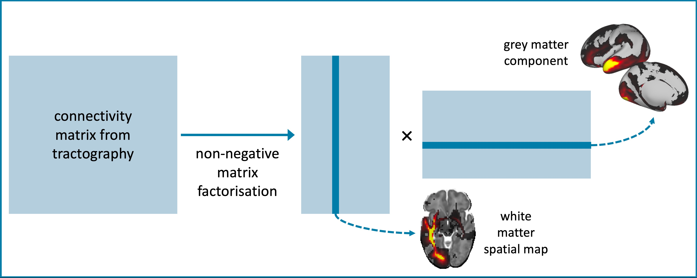

## Current Role
I have recently started a postdoctoral position at UCL in the [POND Group](https://ucl-pond.github.io/). I am working on methods to improve the accuracy of brain connectivity estimation, through a Bayesian inference framework that will enable us to quantify the uncertainty in the analysis pipeline. These connectivity estimates will inform disease progression models, to help improve our understanding of neurodegenerative diseases such as Alzheimer's Disease.

## Previous Work

I completed my PhD in 2021 in the [Computational Neuroimaging Laboratory](https://spmic-uon.github.io/conilab/) at the University of Nottingham, supervised by Professor Stam Sotiropoulos and Dr Matteo Bastiani. During my PhD, I developed new methods for exploring white matter connections in the neonatal brain. 

A key part of my PhD project was a new framework for data-driven connectivity mapping (paper [here](https://www.sciencedirect.com/science/article/pii/S105381192030759X)). We used non-negative matrix factorisation to extract white matter connectivity patterns and their corresponding grey matter networks from whole-brain connectivity matrices. This provides a way of extracting white matter bundles from tractography data, without the need for pre-defined regions of interest.

I also developed a new set of tractography protocols for neonates, based on the [XTRACT](https://www.sciencedirect.com/science/article/pii/S1053811920304092) framework. The protocols allow automated tracking of 42 white matter bundles, and can be found on my Github page [here](https://github.com/ethompson93/baby-XTRACT). *paper coming soon*.

## Other Interests
I am interested in sustainability, and how we can reduce our environmental impact as researchers in neuroimaging. I joined the [OHBM Sustainability and Environmental Action Group](https://ohbm-environment.org/) to gain a better understanding of these issues, and to help communicate them to the wider neuroimaging community as part of the Education and Outreach working group. We have lots of exciting projects in the pipeline, which you can follow on [twitter](https://twitter.com/OhbmEnvironment).

